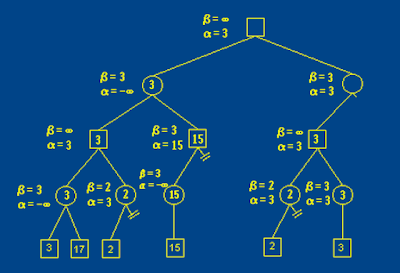

## 競賽樹（game tree)

* 是指組合賽局理論中用來表達一個賽局中各種後續可能性的樹，一個完整的競賽樹（complete game tree）會有一個起始節點，代表賽局中某一個情形，接著下一層的子節點是原來父節點賽局下一步的各種可能性，依照這規則擴展直到賽局結束。競賽樹相同於擴展形式的賽局理論中的樹。競賽樹中形成的葉節點代表各種遊戲結束的可能情形，例如井字遊戲會有26,830個葉節點。

* 競賽樹在人工智慧的應用相當重要，若要尋找某賽局中最佳的步法的一個方式，是利用極小化極大演算法在競賽樹中搜尋最佳解，例如在井字遊戲中電腦可以很快速地找到最佳解並做出決策，但是對於象棋、圍棋這一類大型的賽局遊戲，列出完整競賽樹可能使電腦計算能力難以應付，因此對這類遊戲通常會採用部分的競賽樹（partial game tree）來進行搜尋，典型的部分競賽樹通常是限制競賽樹的層數，並剔除不佳的步法（例如自殺），一般而言搜尋的層數越多，能走出較佳步法的機會也越高。
若是兩人遊戲，除了可以用競賽樹表達之外，也可以用And–or tree表示。

3 5 5 5 5 3

5 8 8 8 8 5

5 8 8 8 8 5

5 8 8 8 8 5

3 5 5 5 5 3

## Minimax with Alpha Beta Pruning

